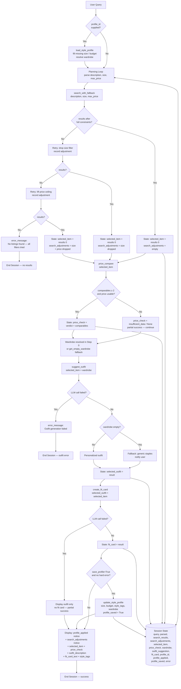

# StyleFindr — Agentic Fashion Application

A multi-tool AI agent that helps users find secondhand clothing listings, suggests outfits intelligently using the user's wardrobe, generates shareable fit captions for social media, and gauges whether a listing's price is fair against comparable items; all from a single natural-language processing query.

---

## Tool Inventory & Outline

> **Latest additions:** Style Profile Memory (`load_style_profile`, `save_style_profile`, `update_style_profile`) and retry logic with fallback (`search_with_fallback`). See [Tool 1b](#tool-1b-search_with_fallback) and [Style Profile Memory](#style-profile-memory) below.

### Tool 1: `search_listings`

**File:** [tools.py:190](tools.py#L190)

| | |
|---|---|
| **Input: `description`** | `str` — Keywords describing the item (e.g., `"vintage graphic tee"`). Stopwords and filler are stripped; whole-word token matching prevents substring noise. |
| **Input: `size`** | `str \| None` — Size filter (e.g., `"M"`, `"XL"`, `"8"`). Apparel sizes and numeric shoe/waist sizes are treated as separate systems, so requesting size `"M"` does not exclude shoes. `None` skips size filtering. |
| **Input: `max_price`** | `float \| None` — Price ceiling (inclusive bound). `None` skips price filtering. |
| **Output** | `list[dict]`: Matching listing dicts sorted by weighted relevance (style tags > title/colors/category/brand > description). Empty list `[]` if nothing matches (never raises). |

**Purpose:** Pure keyword + hard-filter search over the 40-item mock dataset (`data/listings.json`). No LLM call & fully deterministic semantic approach. The agent's entry point: if this returns empty, the loop stops here.

---

### Tool 1b: `search_with_fallback`

**File:** [tools.py:337](tools.py#L337)

| | |
|---|---|
| **Input: `description`** | `str` — Passed through unchanged to `search_listings`. |
| **Input: `size`** | `str \| None` — Size filter; relaxed first if the initial search is empty. |
| **Input: `max_price`** | `float \| None` — Price ceiling; relaxed second if size relaxation also fails. |
| **Output** | `dict` with keys: `results` (list[dict]), `adjustments` (list[str] — each filter that was loosened), `size` (str \| None — the filter actually used), `max_price` (float \| None — the ceiling actually used). |

**Purpose:** Wraps `search_listings` with automatic constraint loosening. Calls the full search first; if empty, drops the size filter and retries; if still empty, lifts the price ceiling and retries. Each relaxation is recorded in `adjustments` so the UI can tell the user exactly what changed (e.g. *"removed the size M filter"*). Returns an empty list with all adjustments listed if nothing matches even without any filters — never raises on an empty result.

---

### Tool 2: `suggest_outfit`

**File:** [tools.py:297](tools.py#L297)

| | |
|---|---|
| **Input: `new_item`** | `dict` — Full listing dict from `search_listings` (uses `title`, `category`, `colors`, `style_tags`). |
| **Input: `wardrobe`** | `dict` — Wardrobe dict with an `"items"` key. Accepts empty wardrobe & triggers a "generic" wardrobe staples fallback without crashing. |
| **Output** | `dict` with keys: `outfit_description` (str), `matching_items` (list[str]), `style_reasoning` (str), `style_category` (str). |

**Purpose:** Uses the Groq LLM (`llama-3.3-70b-versatile`) to reason about style compatibility and suggest one complete, wearable outfit pairing the thrifted (selected) item with pieces the user already owns. If the wardrobe is empty, it suggests generic staples and flags them as such.

---

### Tool 3: `create_fit_card`

**File:** [tools.py:403](tools.py#L403)

| | |
|---|---|
| **Input: `outfit`** | `dict` — Outfit dict from `suggest_outfit` (uses `outfit_description`, `style_category`). Accepts `None` or missing `outfit_description` — falls back to item-only caption. |
| **Input: `new_item`** | `dict` — Listing dict from `search_listings` (uses `title`, `price`, `platform`). |
| **Output** | `dict` with keys: `fit_card_text` (str, 1–3 sentence caption), `style_tags` (list[str], 2–4 hashtag-style keywords), `caption_tone` (str, e.g. `"casual"`, `"confident"`). |

**Purpose:** Generates an authentic, casual social media OOTD caption for the thrifted find. Runs at `temperature=1.0` so that repeat calls on the same input still vary. This is the only tool whose failure is treated as a partial success; the agent displays the outfit without a fit card rather than stopping.

---

### Tool 4: `price_compare`

**File:** [tools.py:692](tools.py#L692)

| | |
|---|---|
| **Input: `item`** | `dict` — Listing dict from `search_listings` (uses `id`, `price`, `category`, `style_tags`). |
| **Output** | `dict` with keys: `verdict` (str — `"underpriced"`, `"fair"`, `"overpriced"`, or `"insufficient_data"`), `item_price` (float \| None), `comparable_count` (int), `comparable_avg` (float \| None), `comparable_median` (float \| None), `comparable_range` (list[float] \| None), `explanation` (str). |

**Purpose:** Estimates whether an item's asking price is fair by comparing it against comparable listings in the dataset. Pure & deterministic (no LLM call), like `search_listings`. Comparables are peers in the same `category` that share at least one `style_tag` (falling back to all same-category listings when too few share tags); the item itself is excluded by `id`. The verdict is the item's price ratioed against the comparable **median**: `≤ 0.85` → underpriced, `0.85–1.15` → fair, `≥ 1.15` → overpriced. Thin data (fewer than 2 comparables) or a missing/non-numeric price returns `"insufficient_data"` rather than raising.

---

### Style Profile Memory

**File:** [tools.py:901](tools.py#L901)

Cross-session preference storage. A profile is a JSON object with four fields:

| Field | Type | Purpose |
|-------|------|---------|
| `preferred_size` | `str \| None` | Size token applied to queries that omit a size |
| `max_price` | `float \| None` | Budget ceiling applied to queries that omit a price |
| `favorite_styles` | `list[str]` | Style tags accumulated from past selected items (capped at 10) |
| `wardrobe` | `dict` | Saved wardrobe reused when no wardrobe is passed at call time |

**Key functions:**

- **`load_style_profile(profile_id)`** — reads the profile store (`data/style_profiles.json`) and returns the normalized profile for the given id; returns a fresh empty profile (never `None`) when none exists yet.
- **`save_style_profile(profile, profile_id)`** — normalizes and writes a profile dict to disk without clobbering other profile ids.
- **`update_style_profile(profile_id, size, max_price, style_tags, wardrobe)`** — convenience writer used by `run_agent` at the end of a successful run to merge the current session's preferences into the saved profile.

**How the agent uses it:** When `run_agent` is called with a `profile_id`, it loads the profile before parsing the query and uses saved `preferred_size` / `max_price` to fill in any field the query left unspecified. Each applied preference is recorded in `session["profile_applied"]` so the UI can surface it. With `save_profile=True`, the session's size, budget, selected item's style tags, and wardrobe are written back at the end of a successful run, so a returning user need not re-describe their preferences.

---

## Planning Loop

**File:** [agent.py:110](agent.py#L110)

The agent uses a **sequential conditional loop**: each step checks the previous output before deciding whether to continue. Tools are not called unconditionally & are instead approached dynamically based on output.

```
Step 0 — Load style profile (if profile_id supplied)
         Apply saved size/budget to any field left unspecified by query
         Record applied preferences in session["profile_applied"]
         Resolve wardrobe: explicit arg > profile wardrobe > empty wardrobe

Step 1 — Parse query (regex, no LLM)
         Extract: description, size, max_price
         Store in session["parsed"]

Step 2 — search_with_fallback(description, size, max_price)
         → Exact search returns results? session["selected_item"] = results[0], continue
         → Empty? Retry without size filter; if still empty, retry without price cap
         → Record each loosened constraint in session["search_adjustments"]
         → Still empty after all relaxations? Set session["error"], STOP

Step 3 — price_compare(selected_item)
         → Error?       session["price_check"] = None, continue (partial success)
         → Otherwise?   session["price_check"] = verdict dict, continue
                        (an "insufficient_data" verdict is still a normal result)

Step 4 — suggest_outfit(selected_item, wardrobe)
         → LLM failure? Set session["error"], STOP (outfit error message)
         → Empty outfit? Set session["error"], STOP
         → Empty wardrobe? Fallback to staples, continue (NOT an error)
         → Success?     session["outfit_suggestion"] = outfit, continue

Step 5 — create_fit_card(outfit_suggestion, selected_item)
         → LLM failure? session["fit_card"] = None, continue (partial success)
         → Success?     session["fit_card"] = fit_card, continue

Step 6 — Save style profile (if save_profile=True and no hard error)
         Persist: size, max_price, item style_tags, wardrobe
         Set session["profile_saved"] = True

Step 7 — Return completed session dict
```

**Query Parsing Choice:** Step 1 uses regex (`_parse_query()` in [agent.py:38](agent.py#L38)), not an LLM call. Price numbers (`under $30`, `$30`), size tokens (`size M`, standalone `XS`/`S`/`M`/`L`/`XL`), and leftover keywords are cheap and deterministic to extract with patterns. Skipping an LLM hop here reduces latency and removes a failure surface before any tool runs.

**Key Behavioral Rule:** An empty `search_listings` result stops the loop entirely. An empty wardrobe in `suggest_outfit` triggers a fallback path but does NOT stop the loop. A failed `price_compare` or `create_fit_card` degrades gracefully & the rest of the result is still shown.

---

## Architecture



---

## State Management

**File:** [agent.py:86](agent.py#L86)

A single **session dict** is initialized at the start of each `run_agent()` call and serves as the sole source of truth for the interaction. No tool re-receives information the user already provided, thus optimizing time & space complexities.

```python
session = {
    "query":              str,          # Original user query (unchanged throughout)
    "parsed":             dict,         # {description, size, max_price} from _parse_query
    "search_results":     list[dict],   # Full list from search_with_fallback
    "search_adjustments": list[str],    # Filters loosened by the fallback retry (empty = exact match)
    "selected_item":      dict | None,  # search_results[0] — top-ranked listing
    "price_check":        dict | None,  # Full dict from price_compare (None = partial success)
    "wardrobe":           dict,         # Resolved wardrobe: explicit arg > profile > empty
    "outfit_suggestion":  dict | None,  # Full dict from suggest_outfit
    "fit_card":           dict | None,  # Full dict from create_fit_card (None = partial success)
    "profile_id":         str | None,   # Style profile id in use, or None
    "profile_applied":    list[str],    # Saved preferences applied to this query
    "profile_saved":      bool,         # True if preferences were persisted this run
    "error":              str | None,   # Set on early termination; None on success
}
```

**Data flow:** `selected_item` passes directly from `search_with_fallback` into `price_compare`, `suggest_outfit`, and `create_fit_card` without user re-entry. Both `outfit_suggestion` and `selected_item` pass directly into `create_fit_card`. The Gradio UI ([app.py:23](app.py#L23)) reads `session["selected_item"]`, `session["price_check"]`, `session["outfit_suggestion"]`, `session["fit_card"]`, `session["search_adjustments"]`, and `session["profile_applied"]` to populate the output panels; the price verdict is folded into the listing panel; adjustments and profile notices are surfaced as info banners.

---

## Error Handling

| Tool | Failure Mode | Agent Response |
|------|-------------|----------------|
| `search_listings` | Returns `[]` | Sets `session["error"]`: *"No listings matched '[desc]' in size [size] under [price]. Try a broader description, a higher budget, or a different size."* Loop stops. |
| `search_listings` | Unexpected exception (e.g., missing data file) | Sets `session["error"]`: *"Search failed due to an unexpected error. Please try again."* Loop stops. |
| `price_compare` | Fewer than 2 comparables, or item has no usable price | Returns `verdict = "insufficient_data"`; the listing panel simply omits the price verdict. Loop **continues** (not an error). |
| `price_compare` | Unexpected exception | `session["price_check"]` is set to `None`. Listing is still shown without a verdict. Loop **continues** (partial success). |
| `suggest_outfit` | Empty wardrobe | LLM is prompted for generic staples; `matching_items` holds those staples; `outfit_description` flags them as suggestions. Loop **continues** (this is not an error). |
| `suggest_outfit` | LLM/API failure | Sets `session["error"]`: *"Outfit generation failed. Please try again."* Loop stops. `create_fit_card` is never called with empty input. |
| `suggest_outfit` | Malformed JSON from LLM | Wraps raw text as `outfit_description`; other fields default to empty. Caller receives the contract shape instead of a crash. |
| `create_fit_card` | `outfit_description` missing or empty | Falls back to item-only caption using `title`, `price`, `platform` only. |
| `create_fit_card` | LLM/API failure | `session["fit_card"]` is set to `None`. Gradio shows *"Fit card generation failed — see your outfit suggestion instead."* Session is still returned (partial success). |
| `create_fit_card` | Malformed JSON from LLM | Wraps raw text as `fit_card_text`; `style_tags` defaults to `[]`. |

**Concrete examples from testing:**

- **`test_search_whole_word_match_no_substring_leak`** ([tests/test_tools.py:88](tests/test_tools.py#L88)): The query `"new pair of combat boots we could keep cheap"` previously surfaced a western-tagged belt as the top hit because `"we"` substring-matched `"western"`. Whole word token matching fixed this: the test asserts no belt appears in results.

- **`test_search_apparel_size_does_not_exclude_shoes`** ([tests/test_tools.py:101](tests/test_tools.py#L101)): Requesting size `"Medium"` (an alpha apparel size) previously excluded all numeric-sized shoes (`"US 8"`). The fix treats the two sizing systems as non-comparable; the test asserts boots still appear in results.

- **`test_suggest_outfit_empty_wardrobe`** ([tests/test_tools.py:150](tests/test_tools.py#L150)): Passing `{"items": []}` to `suggest_outfit` must not crash and must route to the generic-staples branch. The test confirms the returned dict matches the contract shape and that the LLM prompt contains the no-wardrobe fallback language.

- **`test_fit_card_malformed_json`** ([tests/test_tools.py:194](tests/test_tools.py#L194)): When the LLM returns `"<<garbage>>"` instead of JSON, `create_fit_card` wraps the raw string as `fit_card_text` and returns `style_tags: []` rather than raising.

---

## Spec Reflection

**What Matched the Plan:**

The implementation follows the planning.md spec closely. The four tools cover exactly the planned inputs and outputs. The sequential conditional loop in `run_agent()` matches the pseudocode step-for-step: empty search results stop the loop, empty wardrobe triggers a fallback but continues, and a failed fit card is treated as a partial success rather than an error. The session dict field names and data flow arrows in the Mermaid diagram map directly to the code.

**What changed during implementation:**

1. **Size-filter logic became significantly more complex.** The original plan described a simple case-insensitive string match. Testing revealed that apparel sizes (`"M"`, `"S/M"`) and numeric shoe and/or waist sizes (`"US 8"`, `"W30 L30"`) are incompatible systems; filtering across them silently excluded entire categories. The fix introduced `_size_matches()` with cross-system pass-through logic, and a regression test to lock it down.

2. **Keyword matching switched from substring to whole-word tokens.** The original relevance scorer used `in` string containment. During testing, stopwords like `"we"` matched style tags like `"western"`, surfacing irrelevant results. Changing to token-set intersection fixed this and required adding `_STOPWORDS` and `_tokens()`.

3. **`suggest_outfit` return type changed from `str` to `dict`.** The planning.md spec listed the return as a dict, but an earlier implementation draft had it return a plain string. The dict shape (with `outfit_description`, `matching_items`, `style_reasoning`, `style_category`) was formalized to give `create_fit_card` and the Gradio formatter structured fields to work with.

4. **`create_fit_card` failure became partial success, not a hard stop.** The original error table said to display the outfit and note the failure. The implementation encodes this as `session["fit_card"] = None` and lets the Gradio formatter handle the display, which keeps the agent loop simple and the UI consistent.

5. **`search_listings` gained an automatic retry wrapper.** Rather than surfacing an empty-result error immediately, `search_with_fallback` progressively relaxes constraints (size first, then price ceiling) and records each relaxation in `session["search_adjustments"]` so the UI can surface exactly what changed.

6. **Cross-session style profile memory was added.** `run_agent` now accepts an optional `profile_id` / `save_profile` pair. On load, any saved `preferred_size` or `max_price` fills in query fields the user left blank. On save, the session's size, budget, item style tags, and wardrobe are persisted to `data/style_profiles.json` so returning users need not re-describe their preferences.

---

## AI Usage

Two specific instances where AI tooling shaped this project during implementation; documented with what was given as input, what was produced, and what was changed before the output was used.

---

### Instance 1 — Stress-testing the planning loop against failure modes

**Input given to Claude:** The full draft Tool 1–3 specs & the planning loop pseudocode from `planning.md`, framed as: *"Review this as a senior engineer. What edge cases am I not handling & how is my progress thus far?"*

**What Claude produced:** A critique that identified several gaps. The most significant was around API failure handling: the draft loop called `suggest_outfit` and `create_fit_card` with no distinction between the two failure types: an LLM call returning empty output versus an LLM call throwing an exception entirely. Claude pointed out that conflating these would either swallow hard failures silently or treat a missing fit card as a session ending error, when the right behavior was to degrade gracefully. It also flagged that `create_fit_card` failing should be a *partial success* rather than a stop condition, since the outfit is still valid and useful without a caption.

**What was changed before use:** The degraded success pattern for `create_fit_card` was already implied in my draft but not explicit; Claude's framing clarified the distinction. I kept my existing error message wording and the structure of the existing edge case table, then added the explicit partial-success path (`session["fit_card"] = None`, loop continues) and the two separate exception blocks in `run_agent()`: one that stops the session (outfit failure) and one that does not (fit card failure). The session key name (`"error"` vs. `"error_message"`) and the exact user-facing message strings were written by me to match the tone of the rest of the project.

---

### Instance 2 — Fixing a broken relevance filter and size system collision

**Input given to Claude:** A failing query and a reproducible bug. The query `"pair of black combat boots size medium we could keep under $40 if possible please"` with `size="Medium"` was returning a western-tagged belt as the top result instead of any boots. Two distinct problems were at play: (1) the word `"we"` in the query was substring-matching `"western"` in the listing's style tags, inflating the belt's relevance score; and (2) the size filter was excluding numeric sized shoes (`"US 8"`) when an apparel size like `"Medium"` was requested. In concrete terms: semantically incompatible systems were being compared directly. I described both bugs to Claude & asked for a refactor of the filtering and scoring logic to be robust against both.

**What Claude produced:** A revised `search_listings` implementation with two key additions: a token-set intersection approach to relevance scoring (replacing substring `in` checks with whole-word token matching via a `_tokens()` helper), and a `_size_matches()` function that treats alpha apparel sizes and numeric shoe/waist sizes as separate systems, passing through cross-system comparisons rather than filtering them out. It also produced a `_STOPWORDS` set to drop conversational filler before scoring.

**What was changed before use:** The core logic was sound and adopted as-is. Several variable names were renamed to match the existing naming convention in the file. The `_STOPWORDS` set was extended with additional filler terms from my own test queries that Claude's version missed. All docstrings were rewritten from scratch & the generated versions described implementation details already obvious from the code; the final docstrings explain the *why* (e.g., the cross-system reasoning in `_size_matches` that explains the "One Size" and numeric pass-through rules). The two regression tests (`test_search_whole_word_match_no_substring_leak`, `test_search_apparel_size_does_not_exclude_shoes`) were written by me after verifying the fix, not generated.

---

<!--
## Original Starter Kit README (commented out; preserved for reference)

# FitFindr — Starter Kit

This starter kit contains everything you need to begin Project 2.

## What's Included

```
ai201-project2-fitfindr-starter/
├── data/
│   ├── listings.json          # 40 mock secondhand listings
│   └── wardrobe_schema.json   # Wardrobe format + example wardrobe
├── utils/
│   └── data_loader.py         # Helper functions for loading the data
├── planning.md                # Your planning template — fill this out first
└── requirements.txt           # Python dependencies
```

## Setup

```bash
pip install -r requirements.txt
```

Set your Groq API key in a `.env` file (get a free key at [console.groq.com](https://console.groq.com)):
```
GROQ_API_KEY=your_key_here
```

## The Mock Listings Dataset

`data/listings.json` contains 40 mock secondhand listings across categories (tops, bottoms, outerwear, shoes, accessories) and styles (vintage, y2k, grunge, cottagecore, streetwear, and more).

Each listing has: `id`, `title`, `description`, `category`, `style_tags`, `size`, `condition`, `price`, `colors`, `brand`, and `platform`.

Load it with:
```python
from utils.data_loader import load_listings
listings = load_listings()
```

## The Wardrobe Schema

`data/wardrobe_schema.json` defines the format your agent uses to represent a user's existing wardrobe. It includes:

- `schema`: field definitions for a wardrobe item
- `example_wardrobe`: a sample wardrobe with 10 items you can use for testing
- `empty_wardrobe`: a starting template for a new user

Load an example wardrobe with:
```python
from utils.data_loader import get_example_wardrobe
wardrobe = get_example_wardrobe()
```

## Where to Start

1. **Read `planning.md` and fill it out before writing any code.**
2. Verify the data loads correctly by running `python utils/data_loader.py`.
3. Build and test each tool individually before connecting them through your planning loop.

Your implementation files go in this same directory. There's no required file structure for your agent code — organize it however makes sense for your design.
-->
