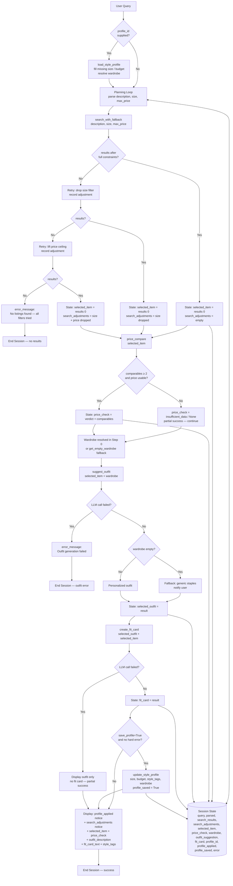

# FitFindr — planning.md

> **Status: Implementation Complete.** All four tools have been implemented & unit tested. Style Profile Memory and retry logic with fallback have been added. The planning loop, state management, and error handling described below match the final code in `tools.py`, `agent.py`, and `app.py`.
> This document was written before implementation and updated to reflect what actually shipped, including deviations noted in the Spec Reflection section of README.md.

---

## Tools

### Tool 1: search_listings

**What it does:**
Searches the mock listings dataset for secondhand clothing items that match the user's description, size, and budget. Returns results sorted by relevance score so the agent can select the best match.

**Input parameters:**
- `description` (str): Keywords describing the desired item (e.g., "vintage cashmere sweater", "designer knitwear")
- `size` (str): The user's preferred clothing size (e.g., "M", "L", "XS")
- `max_price` (float): The maximum price the user is willing to pay in USD

**What it returns:**
A list of matching listing dictionaries, sorted by relevance (descending). Each dict contains:
- `id` (str)
- `title` (str)
- `description` (str)
- `category` (str)
- `style_tags` (list[str])
- `size` (str)
- `condition` (str): e.g., "Good", "Fair", "Like New"
- `price` (float)
- `colors` (list[str])
- `material` (str)
- `brand` (str)
- `platform` (str): e.g., "Depop", "eBay", "Poshmark"

Returns an empty list `[]` if no matches are found.

**What happens if it fails or returns nothing:**
- If the returned list is empty, the agent sets `error_message` in session state and stops the workflow. It does NOT proceed to `suggest_outfit`.
- The agent tells the user: "No listings matched your search for [description] in size [size] under $[max_price]. Try a broader description, a higher budget, or a different size."
- No silent failure. No proceeding with None or empty input downstream.

---

### Tool 2: suggest_outfit

**What it does:**
Given a selected secondhand item and the user's current wardrobe, generates one or more complete outfit combinations that incorporate the new item. Uses an LLM to reason about style compatibility.

**Input parameters:**
- `new_item` (dict): The selected listing dict returned from `search_listings` (full dict, not just title)
- `wardrobe` (dict): The user's wardrobe data as returned by `get_example_wardrobe()` or `get_empty_wardrobe()`

**What it returns:**
A dictionary containing:
- `outfit_description` (str): Natural language description of the recommended outfit (e.g., "Pair the vintage Loro Piana Cashmere Sweater with your Polo Ralph Lauren Oxford Dress Shirt, Uniqlo Pleated Dress Pants, and Gucci Black Leather Loafers for a timeless, elegant look.")
- `matching_items` (list[str]): Names or identifiers of wardrobe items used in the outfit
- `style_reasoning` (str): 1–2 sentence explanation of why this combination works
- `style_category` (str): Generalized aesthetic label (e.g., "quiet luxury", "old money", "streetwear")

**What happens if it fails or returns nothing:**
- If `wardrobe` is empty (`get_empty_wardrobe()`), the tool falls back to recommending generic staple pieces (e.g., "straight-leg jeans, white sneakers"). `matching_items` will contain the fallback staples, and `outfit_description` notes that these are suggestions, not confirmed wardrobe items.
- If the LLM call itself fails (API error, timeout), the agent sets `error_message` and stops. It tells the user: "Outfit generation failed. Please try again."
- The agent does NOT call `create_fit_card` if `outfit_description` is missing or None.

---

### Tool 3: create_fit_card

**What it does:**
Generates a short, shareable social media caption styled like an authentic Instagram or TikTok post — casual, specific to the item and outfit, and different for every input combination.

**Input parameters:**
- `outfit` (dict): The full outfit dict returned by `suggest_outfit` (specifically uses `outfit_description` and `style_category`)
- `new_item` (dict): The selected listing dict from `search_listings` (uses `title`, `price`, `platform`)

**What it returns:**
A dictionary containing:
- `fit_card_text` (str): The caption text itself — conversational tone, 1–3 sentences, may include a single relevant emoji
- `style_tags` (list[str]): 2–4 hashtag-style keywords describing the aesthetic (e.g., ["vintage", "quiet luxury", "old money"])
- `caption_tone` (str): The detected tone of the generated caption (e.g., "casual", "confident", "nostalgic")

**What happens if it fails or returns nothing:**
- If `outfit` dict is missing `outfit_description`, the tool generates a simplified caption using only `new_item` fields (title, price, platform).
- If the LLM call fails entirely, the agent skips the fit card and displays the outfit recommendation directly to the user, noting: "Fit card generation failed — here's your outfit suggestion instead."
- Partial failure is handled gracefully; a missing fit card does not suppress the outfit result.

---

### Tool 4: price_compare

**What it does:**
Given a selected item, estimates whether its asking price is fair by comparing it against comparable listings already in the mock dataset. Pure & deterministic (no LLM call), like `search_listings`: it finds peers in the same category that share style tags, then judges the item's price against the median of those peers.

**Input parameters:**
- `item` (dict): A listing dict (the item being evaluated, e.g. `search_results[0]`). Uses `id`, `price`, `category`, and `style_tags`.

**What it returns:**
A dictionary containing:
- `verdict` (str): One of `"underpriced"`, `"fair"`, `"overpriced"`, or `"insufficient_data"`.
- `item_price` (float): The item's own asking price (echoed back for display).
- `comparable_count` (int): Number of comparable listings found in the dataset.
- `comparable_avg` (float | None): Mean price of the comparables, or `None` when there are too few.
- `comparable_median` (float | None): Median price of the comparables, or `None` when there are too few.
- `comparable_range` (list[float] | None): `[min, max]` price across the comparables, or `None`.
- `explanation` (str): One sentence plain language summary of the verdict.

**Comparable selection:**
A listing is defined as comparable when it is in the same `category` AND shares at least one `style_tag` with the item. If fewer than `_MIN_COMPARABLES` (2) such peers exist, it falls back to all same-category listings so a verdict can still be formed. The item itself is always excluded by `id`.

**Fairness bands (heuristic):** Let `ratio = item_price / median(comparables)`.
- `ratio <= 0.85` → `"underpriced"` (a good deal)
- `0.85 < ratio < 1.15` → `"fair"`
- `ratio >= 1.15` → `"overpriced"`

**What happens if it fails or returns nothing:**
- If fewer than 2 comparables exist even after the category fallback, returns `verdict = "insufficient_data"` with `comparable_avg`/`comparable_median`/`comparable_range` set to `None`. It never raises on thin data.
- If the item has no usable `price` (missing or non-numeric), returns `"insufficient_data"`.
- Like `search_listings`, a dataset load failure propagates so the agent layer can report "comparison failed" distinct from "not enough comparables".

---

## Planning Loop

The agent uses a sequential conditional loop. It does NOT call all tools in a fixed order regardless of results. Each step checks the previous output before proceeding.

```
0. Load style profile (if profile_id supplied)
   → Apply saved preferred_size to query if size was not provided
   → Apply saved max_price to query if budget was not provided
   → Record each applied preference in session.profile_applied
   → Resolve wardrobe: explicit arg > profile wardrobe > empty wardrobe

1. Parse user query → extract description, size, max_price
   Store in session: { description, size, max_price, user_query }

2. Call search_with_fallback(description, size, max_price)
   → If exact search returns results:
       Set session.selected_item = results[0]. Continue.
   → If empty: retry without size filter; record "removed the size X filter"
   → If still empty: retry without price ceiling; record "lifted the $X budget cap"
   → Store all relaxations in session.search_adjustments.
   → If still empty after all relaxations:
       Set session.error_message = "No listings found..."
       Return error to user. STOP.

3. Call price_compare(session.selected_item)
   → On any unexpected error:
       Set session.price_check = None (partial success — do NOT stop).
   → Otherwise:
       Set session.price_check = result (verdict + comparables). Continue.

4. Load wardrobe (resolved in step 0 — already in session.wardrobe)

5. Call suggest_outfit(session.selected_item, session.wardrobe)
   → If LLM call fails or returns None:
       Set session.error_message = "Outfit generation failed."
       Return error to user. STOP.
   → If wardrobe was empty:
       Result uses fallback staples. Store result, continue.
   → If result contains outfit_description:
       Set session.selected_outfit = result
       Continue to step 6.

6. Call create_fit_card(session.selected_outfit, session.selected_item)
   → If LLM call fails:
       Display session.selected_outfit to user without fit card.
       Note: "Fit card generation failed."
       STOP (partial success, not a crash).
   → If fit_card_text is returned:
       Set session.fit_card = result
       Continue to step 7.

7. Save style profile (if save_profile=True and no hard error)
   → Persist: size, max_price, selected item style_tags, wardrobe
   → Set session.profile_saved = True

8. Display final output to user:
   - Profile notice: session.profile_applied (if any)
   - Best match: session.selected_item (title, price, platform, condition)
   - Search adjustments: session.search_adjustments (if any filters were relaxed)
   - Price check: session.price_check (verdict + explanation), if available
   - Outfit suggestion: session.selected_outfit.outfit_description
   - Fit card: session.fit_card.fit_card_text + style_tags
   END SESSION.
```

**The key behavioral rule:** The agent changes behavior based on what each tool returns. An empty list from `search_listings` stops the loop entirely. An empty wardrobe triggers a fallback path, but does not stop the loop. A failed price check or fit card degrades gracefully without hiding the rest of the result.

**Query parsing (Step 1 choice):** Parsing the natural-language query into `description` / `size` / `max_price` is done with **regex/string parsing**, not an LLM call. The three fields are cheap and deterministic to extract — a price number (`under $30` or a bare `$30`), a size token (`size M` or a standalone `XS`/`S`/`M`/`L`/`XL`/`XXS`/`XXL`), and the leftover keywords as the description. Avoiding an LLM hop here keeps Step 1 fast and removes a failure surface before any tool runs. (Implemented as `_parse_query()` in `agent.py`.)

---

## State Management

The agent maintains a single session state dictionary for the duration of the interaction. No tool re-receives information the user already provided.

Tracked state:
- `user_query` (str): The original natural language request
- `description` (str): Extracted item description
- `size` (str): Extracted size
- `max_price` (float): Extracted maximum price
- `search_results` (list[dict]): Full list returned by `search_with_fallback()`
- `search_adjustments` (list[str]): Filters loosened by the fallback retry; empty when the first search matched
- `selected_item` (dict): `search_results[0]` — the top-ranked listing
- `price_check` (dict | None): Full dict returned by `price_compare()`; `None` on partial failure
- `wardrobe` (dict): Resolved wardrobe — explicit arg, profile-saved wardrobe, or empty fallback
- `selected_outfit` (dict): Full dict returned by `suggest_outfit()`
- `fit_card` (dict): Full dict returned by `create_fit_card()`
- `profile_id` (str | None): Style profile id in use, or None
- `profile_applied` (list[str]): Saved preferences applied to this query (e.g. `["size M", "budget $50"]`)
- `profile_saved` (bool): True if preferences were persisted to disk this run
- `error_message` (str | None): Set when any tool fails; controls early termination

Data flow: `selected_item` is passed directly into `price_compare`, `suggest_outfit`, and `create_fit_card` without user re-entry. `selected_outfit` and `selected_item` are both passed into `create_fit_card`. The user never needs to repeat information between steps.

---

## Error Handling

| Tool | Failure mode | Agent response |
|------|-------------|----------------|
| `search_with_fallback` | Returns empty list after all relaxations | Tell user: "No matches for [query]…" with each attempted relaxation listed. Stop workflow. |
| `search_with_fallback` | Results found only after loosening filters | Continue; surface `search_adjustments` in the UI so user knows what changed. |
| `search_listings` | Unexpected exception | Log error, tell user: "Search failed due to an unexpected error. Please try again." Stop workflow. |
| `price_compare` | Fewer than 2 comparables, or item has no usable price | Returns `verdict = "insufficient_data"`; the UI simply omits the price verdict. Loop **continues** (not an error). |
| `price_compare` | Unexpected exception | Set `session.price_check = None`. Loop continues (partial success); the listing is still shown without a price verdict. |
| `suggest_outfit` | Wardrobe is empty | Use generic staple pieces as fallback. Notify user that personalized matching was unavailable. Continue to `create_fit_card`. |
| `suggest_outfit` | LLM call fails or returns None | Tell user: "Outfit generation failed. Please try again." Stop workflow. Do not call `create_fit_card` with empty input. |
| `create_fit_card` | Outfit dict missing `outfit_description` | Generate simplified caption from `new_item` fields only. |
| `create_fit_card` | LLM call fails entirely | Display outfit recommendation to user without fit card. Note the partial failure. Do not crash the session. |

---

## Architecture



---

## AI Tool Plan

**Milestone 3 — Individual tool implementations:**

- **`search_listings`**: Give Claude the Tool 1 spec from this document (inputs, return value, both failure modes) plus the `load_listings()` signature from `utils/data_loader.py`. Ask it to implement filtering by all three parameters and relevance ranking via style_tags/description keyword matching. Verify before use: (1) test with "vintage cashmere sweater", L, $200 — expect ≥1 result; (2) test with "purple sequin ballgown", XS, $5 — expect empty list and correct early return; (3) test with no size filter to confirm size is still respected.

- **`suggest_outfit`**: Give Claude the Tool 2 spec plus the wardrobe schema from `data/wardrobe_schema.json` and both getter function signatures. Ask for an LLM call that receives `new_item` fields and wardrobe items and returns the specified dict. Verify: (1) run with `get_example_wardrobe()` and confirm `matching_items` contains actual wardrobe piece names; (2) run with `get_empty_wardrobe()` and confirm fallback staples appear in output and user is notified.

- **`create_fit_card`**: Give Claude the Tool 3 spec plus 2 example outfit dicts as input. Ask it to prompt the LLM to produce casual, caption-style text — not product descriptions. Verify: (1) run with two different outfits and confirm the fit card text differs meaningfully; (2) run with a dict missing `outfit_description` and confirm it falls back to item-only caption.

**Milestone 4 — Planning loop and state management:**

Give Claude the full planning loop pseudocode from this document, the Mermaid architecture diagram, and the state dictionary spec. Ask it to implement the loop as a function that accepts a user query string and returns the final session state dict. Verify by running:
1. Full success path (all 3 tools complete)
2. Empty search results path (loop stops at step 2)
3. Empty wardrobe path (fallback outfit, continues to fit card)
4. Simulated LLM failure on `suggest_outfit` (loop stops at step 4, no fit card called)

Implementation is only complete when all 4 paths behave exactly as specified above.

---

## A Complete Interaction (Step by Step)

FitFindr is a multi-tool AI agent that helps users find secondhand clothing, style new pieces with their existing wardrobe, and generate a shareable outfit caption. The planning loop selects which tool to call next based on what was returned — it does not run all three tools unconditionally. If a tool fails or returns an empty result, the agent communicates clearly and stops rather than continuing with invalid data.

**Example user query:** "I'm looking for a vintage Loro Piana cashmere sweater under $200, size L. I mostly wear dress shirts, tailored trousers, and leather loafers."

**Step 1 — search_listings:**

Agent extracts:
- `description` = "vintage cashmere sweater"
- `size` = "L"
- `max_price` = 200.00

Calls: `search_listings(description="vintage cashmere sweater", size="L", max_price=200.00)`

Returns top-3 matching listings. Agent stores `selected_item = results[0]`:
```
Title:     Loro Piana Vintage Cashmere Sweater
Price:     $200.00
Platform:  eBay
Condition: Fair
Size:      L
Style tags: ["vintage", "cashmere", "luxury", "quiet luxury", "knitwear"]
```

**Step 2 — suggest_outfit:**

Agent loads `wardrobe` via `get_example_wardrobe()`. Calls:
`suggest_outfit(new_item=selected_item, wardrobe=wardrobe)`

Returns:
```python
{
  "outfit_description": "Pair the vintage Loro Piana Cashmere Sweater with your Polo Ralph Lauren Oxford Dress Shirt, Uniqlo Pleated Dress Pants, and Gucci Black Leather Loafers for a timeless, elegant look.",
  "matching_items": ["Polo Ralph Lauren Oxford Dress Shirt", "Uniqlo Pleated Dress Pants", "Gucci Black Leather Loafers"],
  "style_reasoning": "The soft cashmere layer over a crisp Oxford adds quiet depth to the silhouette, while the pleated trousers and leather loafers keep the look grounded in classic tailoring.",
  "style_category": "quiet luxury"
}
```

Agent stores as `selected_outfit`.

**Step 3 — create_fit_card:**

Calls: `create_fit_card(outfit=selected_outfit, new_item=selected_item)`

Returns:
```python
{
  "fit_card_text": "Timeless elegance on this classic Loro Piana Cashmere Sweater — pairs perfectly with my Black Gucci Loafers. Best find in a while. 🖤",
  "style_tags": ["vintage", "quiet luxury", "old money", "thrifted"],
  "caption_tone": "confident"
}
```

**Final output to user:**

```
Best match found:
  Loro Piana Vintage Cashmere Sweater — $200.00 (eBay, Fair condition)

Outfit suggestion:
  Pair the vintage Loro Piana Cashmere Sweater with your Polo Ralph Lauren
  Oxford Dress Shirt, Uniqlo Pleated Dress Pants, and Gucci Black Leather
  Loafers for a timeless, elegant look.

Fit card:
  "Timeless elegance on this classic Loro Piana Cashmere Sweater — pairs
  perfectly with my Black Gucci Loafers. Best find in a while. 🖤"

  Tags: #vintage #quietluxury #oldmoney #thrifted
```

**Error path example:**

If `search_listings` returns `[]`:
> "No listings matched 'vintage cashmere sweater' in size L under $200. Try raising your budget, searching a broader term like 'cashmere sweater', or removing the size filter."
> Agent stops. `suggest_outfit` is never called.

---

## Implementation State

### What shipped vs. what was planned

**`search_listings` (tools.py:190)**
- Implemented as planned. Added `_STOPWORDS`, `_tokens()`, and whole word token matching to prevent substring noise (e.g., `"we"` matching `"western"` style tags).
- Size filtering required a dedicated `_size_matches()` function to handle two incompatible sizing systems (alpha apparel vs. numeric shoe and/or waist). Cross-system requests pass through without excluding unrelated categories.
- Relevance is scored by `_relevance_score()` with weighted tiers: style tags (3 pts) > title/colors/category/brand (2 pts) > description (1 pt). Ties are broken by price ascending.

**`suggest_outfit` (tools.py:297)**
- Return type is `dict` (not `str`) with keys `outfit_description`, `matching_items`, `style_reasoning`, `style_category`. This matches the spec.
- Empty wardrobe triggers a different prompt branch, not a failure. The LLM is asked for generic staples; the description flags them as suggestions.
- `_normalize_outfit()` ensures all four contract keys exist regardless of LLM output shape.

**`create_fit_card` (tools.py:403)**
- Returns `dict` with keys `fit_card_text`, `style_tags`, `caption_tone`.
- Runs at `temperature=1.0` for dynamic caption variety upon regeneration.
- Missing or empty `outfit_description` routes to a simplified item-only prompt (no crash, no None return).
- `style_tags` is capped at 4 items by `_normalize_fit_card()`.

**`price_compare` (tools.py)**
- Implemented as planned: pure and deterministic, no LLM call. Mirrors `search_listings` in style.
- Comparables are selected by `_find_comparables()` — same category plus shared style tag, with a same-category fallback when too few peers exist. The item itself is excluded by `id`.
- The verdict is computed from the median of comparables via `_price_verdict()` with the `0.85` / `1.15` ratio bands. Thin data (< 2 comparables) or a missing/non-numeric price returns `"insufficient_data"` rather than raising.

**`search_with_fallback` (tools.py:337)**
- Wraps `search_listings` with two-stage relaxation: drop size first, then lift the price ceiling.
- Each loosening is recorded as a human-readable string in `adjustments` (e.g. `"removed the size M filter"`).
- Returns the empty list plus all attempted adjustments if nothing matches even without filters — never raises.

**Style Profile Memory (tools.py:901)**
- `load_style_profile(profile_id)` reads `data/style_profiles.json`; returns an empty profile (not `None`) on first use or a corrupt file.
- `save_style_profile` / `update_style_profile` normalize the profile to the contract shape before writing, so hand-edited or partially-populated files can't crash the agent.
- Profile fields: `preferred_size`, `max_price`, `favorite_styles` (capped at 10), `wardrobe`.

**Planning loop (agent.py:133)**
- `_parse_query()` (regex) extracts `description`, `size`, `max_price` — no LLM call at parse time.
- Step 0 (new): loads the style profile and fills in missing `size` / `max_price` from saved preferences; resolves the wardrobe.
- Step 2 now calls `search_with_fallback` instead of `search_listings`; `session["search_adjustments"]` carries the loosening record.
- `price_compare` runs right after the top listing is selected; its result is stored in `session["price_check"]`. An unexpected error leaves `price_check = None` (partial success), so the price step never stops the loop.
- `create_fit_card` failure is a partial success: `session["fit_card"] = None`, session still returned.
- Session dict uses `"error"` key (not `"error_message"` as originally specified; simplified for consistency).
- New session keys: `search_adjustments`, `profile_id`, `profile_applied`, `profile_saved`.

**Gradio UI (app.py)**
- `handle_query()` maps the session dict to three output panels via `_format_listing()`, `_format_outfit()`, `_format_fit_card()`. The price verdict is folded into the listing panel by `_format_price()`.
- `_format_fit_card(None)` returns a graceful degraded message; `_format_price(None)` contributes an empty string so a missing price verdict simply drops out of the listing panel rather than crashing.

### Files

| File | Role |
|------|------|
| [tools.py](tools.py) | All four tools + search fallback + style profile memory + LLM helpers |
| [agent.py](agent.py) | Planning loop, query parser, session state, profile load/save |
| [app.py](app.py) | Gradio UI, query handler, output formatters, profile/adjustment banners |
| [tests/test_tools.py](tests/test_tools.py) | pytest tests covering all tools, fallback retry, and profile memory |
| [tests/test_agent.py](tests/test_agent.py) | pytest tests covering the planning loop and profile integration |
| [utils/data_loader.py](utils/data_loader.py) | Dataset + wardrobe loaders |
| [data/listings.json](data/listings.json) | 40 mock secondhand listings |
| [data/wardrobe_schema.json](data/wardrobe_schema.json) | Wardrobe format + example wardrobe |
| [data/style_profiles.json](data/style_profiles.json) | Persisted style profiles (created on first save) |

<!--
## Original Starter Kit plannind.md (commented out & preserved for reference)

> Complete this document before writing any implementation code.
> Your spec and agent diagram are what you'll use to direct AI tools to generate your implementation — the more specific they are, the more useful the generated code will be.
> Your planning.md will be reviewed as part of your submission.
> Update it before starting any stretch features.
-->